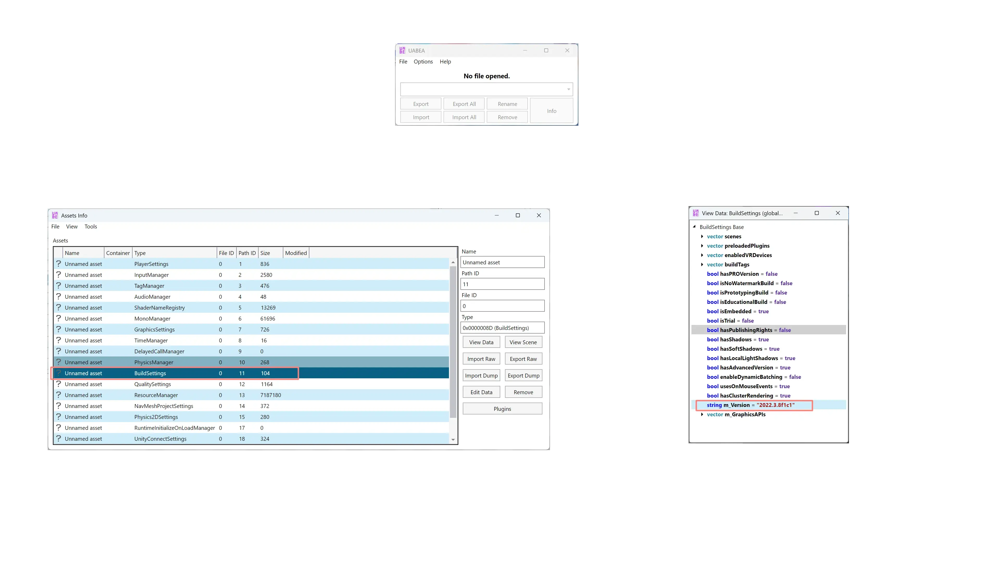

本系列主要介绍在没有游戏源代码的情况下，将 Unity 游戏移植到其他平台的实用方法。
内容主要适用于Unity的标准构建类型（Mono），在IL2CPP或WebGL构建无效。

示例游戏选用了[三相奇谈（仓库ID：3084281）](https://store.steampowered.com/app/3084280/)游戏，将其移植到 Linux 平台。

## 1. 确认游戏使用的 Unity 引擎版本

查看`<游戏目录>/<游戏名称>__Data/globalgamemanagers`文件内的数据可以准确的得到游戏所使用的 Unity版本。

查看此文件有两种办法

### 直接使用记事本查看 UnityFS版本

使用记事本打开`globalgamemanagers`文件，在`0x0038`到`0x0043`位置可以看到 UnityFS 的版本号。

### 拆解 UnityFS 查看`BuildSettings`类型数据

推荐使用 [UABEA](https://github.com/nesrak1/UABEA) 来拆开`globalgamemanagers`文件，查看里面的数据

